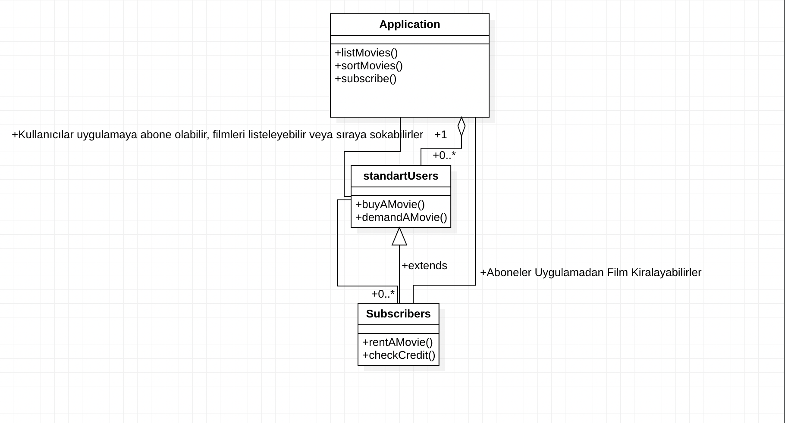

# Online-Movie-Management-System

[Patika.dev](https://www.patika.dev/tr)

Belirtilen kriterlere göre Online Film Sistemini UML-Tasarımıyla izahının yapıldığı projedir.

---

```

Online film satan veya kiralayan uygulamanın sistemini tasarlayın.

 - Uygulamada filmler listelenebilir, sıralanabilir ve kullanıcılar uygulamaya abone olabilir.
 - Kullanıcılar abonelik için sistem üzerinden kredi satın alır.
 - Sadece abone olan kullanıcılar, kredileri ile film kiralayabilir ve kiraladığı filmin kredi bedeli kadar hesabından düşülür.
 - Normal kullanıcılar ve aboneler film satın alabilirler.
 - Eğer film mevcut değil ise talep edilebilir.
 - Bu sistemi tasvir eden Class(Sınıf) diyagramını çiziniz.

```

## İstenen Tasarımın UML Hali

Aşağıda, istenen tasarımın UML programı kullanılarak (StarUML) gerçekleştirilmiş hali bulunmaktadır.

Projeye ait ekran görüntüsünü paylaştıktan sonra, tasarımda ifade edilmek istenenleri de resmin altına açıklama satırı olarak yazacağım.



1. Kullanıcının sistem üzerinden kredi satın alması, Application class’ı içerisinde ki subscriber() metodunun Standart Users Class’ı tarafından çalıştırılmasıyla gerçekleşmektedir.

2. Aboneler sınıfı Standart kullanıcılardan kalıtım alan sınıflar oldukları için Uygulamadan film satın alabilir, film talebinde bulunabilir ve film kiralayabilirler.
Aboneler sınıfı içerisinde ki checkCredit() metodu, abone uygulamadan film kiralayacağı anda devreye girer ve kredinin bitip bitmediğini denetler. 
Ona göre abone Standart kullanıcıya çekilir.